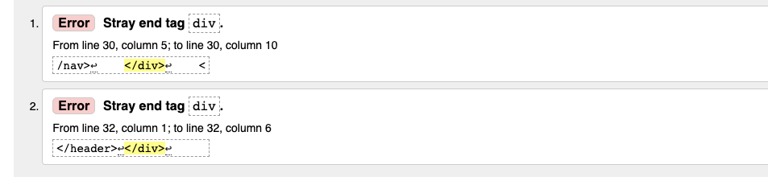
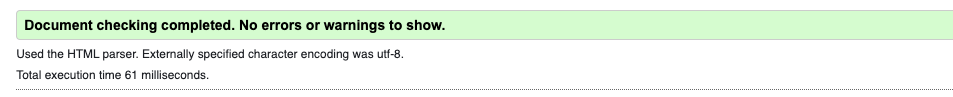

# **Creative Dreams**
Creative Dreams is a website that target people who are in need of help with professional recording, mixing and mastering within the music and sound context. Today almost everyone can record music and sounds in their own home but Creative Dreams wants to make it easy for the users to get in contact and start working with a professional studio.

The Creative Dreams website is 100% fictional and was created for Portfolio Project #1 (HTML&CSS) - Diploma in Full Stack Software Development Diploma at the [Code Institute](https://www.codeinstitute.net).

[View live website here](https://worldofmarcus.github.io/project-portfolio-1/)

# Table of Content 

* [**Project**](<#project>)
    * [Site Users Goal](<#site-users-goal>)
    * [Site Owners Goal](<#site-owners-goal>)

* [**User Experience (UX)**](<#user-experience-ux>)
    * [Wireframes](<#wireframes>)
    * [Site Structure](<#site-structure>)
    * [Design Choices](<#design-choices>)

* [**Features**](<#features>)
    * [Navigation Bar](<#navigation-bar>)
    * [Hero Section](<#hero-section>)
    * [About Us Section](<#about-us-section>)
    * [Our Services Section](<#our-services-section>)
    * [Portfolio Section](<#portfolio-section>)
    * [Contact Section](<#contact-section>)
    * [Footer Section](<#footer-section>)
    * [Form Confirmation Page](<#form-confirmation-page>)

* [**Features Left To Implement**](<#features-left-to-implement>)

* [**Technologies Used**](<#technologies-used>)
    * [Languages](<#languages>)
    * [Frameworks, Librarys & Software](<#frameworks-libraries--software>)

* [**Testing**](<#testing>)
  * [Code Validation](<#code-validation>)
  * [Responsiveness Test](<#responsiveness-test>)
  * [Browser Compatibility](<#browser-compatibility>)
  * [Additional Testing](<#additional-testing>) 
  * [Known Bugs](<#known-bugs>)
* [Deployment](<#deployment>)
* [Credits](<#credits>)
* [Acknowledgements](<#acknowledgements>)

#   Project

## **Site Users Goal**
The site users are in need of help with professional recording, mixing and mastering of sound/music. The user wants to be able to navigate through the whole site in an efficient and intuitive way and be able to contact Creative Dreams easily.

## **Site Owners Goal**
The goal of the site is to reach new customers and clients within the context of recording, mixing and mastering of sound and music. The site will help reaching out to potential new customers and clients which will increase the inflow of warm leads. The outcome will be strenghtened branding and increased revenue.

# User Experience (UX)

## Wireframes
The wireframes for Creative Dreams were created in the software [Balsamiq](https://balsamiq.com). The wireframes have been created for desktop, tablet and mobile devices. Relevant text content had not been written when the wireframes was produced. The final site has some smaller visual differences compared to the wireframes due to design choices that was being made during the process of creation.

[Back to top](<#table-of-content>)
## Site Structure
The Creative Dreams website has five pages. The first four pages are accessable through a sticky navigation menu in the top of the [home page](index.html). The links are anchor links that gets highlighted after being clicked to make sure the user knows where they are on the page. There is also a [form confirmation page](form-confirmation.html) that the user will be sent to after clicking the submit button in the contact form on the home page. The confirmation page has clear instructions how to get back to the main page (both through direct link and top menu).

[Back to top](<#table-of-content>)
## Design Choices

* ### Color Scheme
  The color scheme chosen for Creative Dreams is based on different shades of gray. The user gets no surprises regarding the colors on the site and the choice of colors creates a sense of calmness, structure and modern look. Colors have been chosen to create good readability and contrast (background color on the body: #FFF, background on all sections: #F3F3F3, text color: #5F5F5F, box shadow with opacity: rgba(0, 0, 0, 0.4).
  

* ### Typography
  The fonts used on the Creative Dreams website are 'Montserrat' and 'Oswald'. Fallback font for both of them is sans-serif. Both fonts are easy to read and creates a good contrast to the background.

  * 'Montserrat' was chosen due to it's clean and almost 'poster-like' look. It's being used both as headlines and in running text.
  * 'Oswald' was chosen for the quote plate on the hero image to get the users attention with its more intense look.
  

[Back to top](<#table-of-content>)
# **Features**
The features on the Creative Dreams website will help the users to understand what Creative Dreams offer and in an easy way initiate contact. General examples of features are *navigation bar*, *contact form*, *about section*, *our services section* and *examples of clients*.

## **Existing Features**

* ### Navigation Bar

  * The navigation section will help the user to, in an easy way, navigate on the page.

  * All sections on the site are gathered on the landing page (*index.html*) and the navigation bar, that is fully responsive, includes anchor links (with smooth scrolling) to *home*, *about*, *our services*, *portfolio* and *contact*.

  * The navigation is fixed / sticky and the menu items will stay highlighted after being clicked to make sure the user knows where they are on the site.
 
 

[Back to top](<#table-of-content>)
* ### Hero Section

  * The landing page includes a photograph with an overlay text box including an inspirational quote by Elizabeth Gilbert (*"A creative life is an amplified life, it's a bigger life, a happier life, an expanded life, and a hell of a lot more interesting life"*).

  * This section will get the users attention and inspire to learn more about Creative Dreams.

 

[Back to top](<#table-of-content>)
* ### About Us Section

  * The about section is an important part of a webpage and has descriptive information about a company. It will introduce the user to who Creative Dreams are, a high-end studio with one clear mission, *to deliver top quality recordings, mixing and mastering solutions* to the customers.

 

[Back to top](<#table-of-content>)
* ### Our Services Section

  * The Our Services Section will introduce the user to what services Creative Dreams offers (*recording*, *mixing*, *mastering* and *brainstorming*).

  * This section will make the user interested in Creative Dreams products and trigger them to learn more and initiate contact.

[Back to top](<#table-of-content>)
* ### Portfolio Section

  * A portfolio is intended to showcase a collection of high-end work. This is Creative Dreams portfolio and here the user will find examples of work that has been done in the past.

  * The user will in this section also get information of which clients Creative Dreams have worked with.

  * The portfolio is of great importance to make the user (*potential customer*) feel comfortable and safe to initiate contact with Creative Dreams.

 

[Back to top](<#table-of-content>)
* ### Contact Section

  * The contact section includes a form with both required and non-required fields/options where the user can include *First name*, *Last name*, *E-mail*, *Topic (Recording, Mixing, Mastering, Brainstorming*) and the possibility to sign-up for a *newsletter*. The form includes *submit* and a *reset* button. The aim is to make a very straight-forward form to make it easy for the user to initate contact. When the user submits the form a [form confirmation page](#form-confirmation-page) will open. The page only validates the form.

  * The contact section includes an embedded Google Map that shows were Creative Dreams are located.

  * Below the Google Map social media links to *Facebook*, *Youtube*, *Instagram*, *Spotify* and *Apple Music* are included. Phone number and adress to Creative Dreams is included as well.

 

[Back to top](<#table-of-content>)
* ### Footer Section

  * The footer section includes Creative Dreams copyright information.

[Back to top](<#table-of-content>)
* ### Form Confirmation Page

  * The form confirmation page will inform the user that the form successfully has been sumbitted with the text *Thank you! We have receieved your message and will get back to you as soon as possible! Click here to get back to the main page!* The main menu is also visible so the user easily can get back to the main page (*back-button in browser not needed*)

[Back to top](<#table-of-content>)
### Features Left to Implement

* Implement a hamburger-menu when users are on a tablet / phone.
* Online Mastering tool (upload sound files that is being masterered through AI technique).
* Implement chat with Creative Dreams staff through the homepage.
* Implement Carousel function on Hero Section.

[Back to top](<#table-of-content>)
# Technologies Used

## Languages

* [HTML5](https://html.spec.whatwg.org/) - provides the content and structure for the website.
* [CSS3](https://www.w3.org/Style/CSS/Overview.en.html) - provides the styling.
* [Javascript](https://www.javascript.com/) - provides extra functionality on the site (top navigation bar)

[Back to top](<#table-of-content>)
## Frameworks, Libraries & Software

* [Adobe Photoshop](https://www.adobe.com/se/products/photoshop.html) - used to resize the pictures on the site.
* [Am I Responsive](https://ui.dev/amiresponsive) - used to create presentation of responsive design.
* [Apple Logic Pro](https://www.apple.com/logic-pro/) - used to make audio files in portfolio section.
* [Balsamiq](https://balsamiq.com/wireframes/) - used to create the wireframes.
* [Colormind](http://colormind.io/) - used to create the color palette.
* [Convertio](https://convertio.co/jpg-webp/) - used to convert png to webp.
* [Favicon.io](https://www.favicon.io) - used to create favicon for the site.
* [Font Awesome:](https://fontawesome.com/) - used to import icons to the website.
* [Github](https://github.com/) - used to host and edit the website.
* [Gitpod](https://www.gitpod.io/#get-started) - used to deploy the website.
* [Google Chrome DevTools](https://developer.chrome.com/docs/devtools/) - used to test website.
* [Google Fonts](https://fonts.google.com/) - used to import fonts to the website.
* [Google Maps](https://www.google.com/maps) - used to embed map with Creative Studios location.
* [Jquery](https://jquery.com/) - used to implement highlight function on top navigation after being clicked.
* [Lighthouse](https://developer.chrome.com/docs/lighthouse/overview/) - used to test performance of site.
* [Responsive Design Checker](https://www.responsivedesignchecker.com/) - used for responsiveness check.
* [Shutterstock](https://www.shutterstock.com/sv/) - used to get video clips to the site.
* [Tailorbrands](https://studio.tailorbrands.com/) - used to create client logos to the site.
* [TinyPNG](https://tinypng.com/) - used to compress images.
* [Wave Web Accessibility Evaluation Tool](https://wave.webaim.org/) - used to validate the sites accessibility.

[Back to top](<#table-of-content>)
# Testing

## Code Validation
The Creative Dreams has been tested through both [W3C html Validator](https://validator.w3.org/) and the [W3C CSS Validator](https://jigsaw.w3.org/css-validator/). Minor errors were found on the Form Confirmation Page but could easily be fixed.

### HTML Validator
The HTML validator results for each page can be seen below:

* Home Page

No errors were returned when passing through the official W3C validator.

* Form Confirmation page

Some minor errors were reported. The errors were generated by two faulty div elements in form_confirmation.html.

It was easy to fix and when the page was re-run in the validator no errors were returned.

[Back to top](<#table-of-content>)
### CSS Validator
The CSS validator results can be seen below:

No errors were returned when passing through the official W3C validator.

[Back to top](<#table-of-content>)
# Responsiveness Test

The responsive design tests were carried out manually with [Google Chrome DevTools](https://developer.chrome.com/docs/devtools/) and [Responsive Design Checker](https://www.responsivedesignchecker.com/).

| Desktop    | Display <1280px       | Display >1280px    |
|------------|-----------------------|--------------------|
| Render     | pass                  | pass               | 
| Images     | pass                  | pass               | 
| Links      | pass                  | pass               |

| Tablet     | Samsung Galaxy Tab 10 | Amazon Kindle Fire | iPad Mini | iPad Pro |
|------------|-----------------------|--------------------|-----------|----------|
| Render     | pass                  | pass               | pass      | pass     | 
| Images     | pass                  | pass               | pass      | pass     | 
| Links      | pass                  | pass               | pass      | pass     | 

| Phone      | Galaxy S5/S6/S7       | iPhone 6/7/8       | iPhone 12pro         |
|------------|-----------------------|--------------------|----------------------|
| Render     | pass                  | pass               | pass      | pass     | 
| Images.    | pass                  | pass               | pass      | pass     | 
| Links      | pass                  | pass               | pass      | pass     | 

*Comment: To keep the design together on wider screens the content of the site is restricted to 1280px.*

[Back to top](<#table-of-content>)
## Browser Compatibility

Creative Dreams website was tested on the following browsers on desktop, tablet and phone with no visible issues for the user. 

* Google Chrome Version (103.0.5060.114)
* Mozilla Firefox (version 102.0.1)
* Min (version 1.25.1)
* Apple Safari (version 15.5)
* Microsoft Edge (version 103.0.1264.62)

[Back to top](<#table-of-content>)
## Additional Testing

### WAVE

[WAVE](https://wave.webaim.org/) was used to check accessibility. 0 errors and 31 alerts was found. 17 of the alerts were connected to justified text which in the context isn't a critical issue. The rest of the alerts were connected to the video/audio (*lack of synchronized captions and transcripts*) which isn't critical in this context.

[Back to top](<#table-of-content>)

### Lighthouse
[Google Lighthouse](https://developers.google.com/web/tools/lighthouse) in Chrome Developer Tools was used to test the website for *Performance*, *Accessibility*, *Best Practices* and *SEO*. The testing showed that the *Accessability*, *Best Practices* and *SEO* was 100%. The Performance fluctuated between 83 and 90. The main reason for the decreased performance is the audio/video clips on the site (*and to some extent the hero image*) even after compression.

**Lighthouse result Main Page**

**Lighthouse result Form Confirmation Page**

[Back to top](<#table-of-content>)

### Peer Review
Additional testing of the site was conducted mainly by people outside of the software development field. Some spelling and grammar errors were found and corrected. In general there were no challenges with the design.

## Known bugs

**2022-07-14**
* Bug: Hover effect on logo not working properly on Safari. **Update 2022-07-20** Fixed by changing color from RGBA to #.
* Bug: Challenges with portfolio section. Grid system not responsive. I think it has to do with the video content. Need a solution to that. **Update 2022-07-16** Fixed responsiveness problem for video/audio content by adding max width to Video and Audio elements.

**2022-07-16**
* Bug: When changing to @media 950px and and below the logo isn't 100% centered. I tried to fix it by removing letter-spacing on the font awesome-symbol, it got better but didn't solve the problem fully. It look's good enough but I need to check this later on in the project.  **2022-07-16** Bug fixed, the problem was the padding property (*changed to 0*).

### Unfixed Bugs
* 2022-07-20 No known bugs

[Back to top](<#table-of-content>)
## Deployment
The site was deployed to GitHub pages. The steps to deploy are as follows:

1. In the GitHub repository, navigate to the Settings tab

[Back to top](<#table-of-content>)

2. Go to the Pages link in the left menu

[Back to top](<#table-of-content>)

3. From the source section drop-down menu, select the main branch (can be master in some cases but for me it was main)

4. Once the main branch has been selected, the page will be automatically refreshed and information about successful deployment / publishing can be seen on screen. The live link can be found [here](https://worldofmarcus.github.io/project-portfolio-1/index.html).

[Back to top](<#table-of-content>)
## Credits

### Content

* All text content written by Marcus Eriksson except quote on the hero plate which was written by author Elizabeth Gilbert.

* Some help and instructions in how to implement CSS grid was taken from [this YouTube Tutorial](https://www.youtube.com/watch?v=sKFW3wek21Q&t=498s)

* All the icons on the website were taken from [Font Awesome](https://fontawesome.com/)

* Javascript to add/remove active class on click taken from ['Online Tutorials - Add Remove Active Class On Click - Html CSS and Javascript' on Youtube](https://www.youtube.com/watch?v=7Vr1bngah-k)

* General tips and tricks during the project was taken from [W3C Schools](https://www.w3schools.com/)

* [Template](https://github.com/Code-Institute-Solutions/readme-template) for read.me provided by Code Institute (*with some additional changes that my mentor [Precious Ijege](https://www.linkedin.com/in/precious-ijege-908a00168/))* suggested.

### Media

* Hero Image taken from [Unsplash](https://unsplash.com/photos/c1ZN57GfDB0) - Photo by Jonathan Velasquez

* Video 1 in portfolio section taken from [Shutterstock (video 1)](https://www.shutterstock.com/sv/video/clip-1058308858-rock-band-guitarists-drummer-performing-concert-night)

* Video 2 in portfolio section taken from [Shutterstock (video 2)](https://www.shutterstock.com/sv/video/clip-1058126545-four-man-rock-band-lead-singer-guitarist)

* Audio Clips - Made by Marcus Eriksson in the software synth 'Dune 3' by [Synapse Audio Software](https://www.synapse-audio.com/dune3.html)

[Back to top](<#table-of-content>)
## Acknowledgements
The Creative Dreams site was completed as the Portfolio Project #1 (*HTML&CSS*) for the Full Stack Software Development Diploma at the [Code Institute](https://codeinstitute.net/). I would like to thank my mentor [Precious Ijege](https://www.linkedin.com/in/precious-ijege-908a00168/) for relevant feedback during the project.

*Marcus Eriksson 2022.*

[Back to top](<#table-of-content>)